# 나 혼자 시작하는 Oracle Cloud 첫걸음: Free Tier계정을 이용한 오라클 클라우드 기본 서비스 생성

Oracle Modern Cloud Day 2019의 Developer Hands-on Track


## 과정 소개

본 핸즈온 과정은 Oracle Cloud Infrastructure를 처음 접하는 분이라도 누구나 쉽게 클라우드를 배포하고 구성하여 간단한 애플리케이션을 테스트 해 볼 수 있도록 쉬운 내용을 다루고 있으며 가장 기본이 되는 Network, Compute, Storage 리소스에 일반적인 설정으로 즉시 테스트 또는 운영환경으로 사용 할 수 있도록 구성하였습니다. 


## 사전 준비 사항


* 인터넷 접속 가능한 랩탑
* OCI (Oracle Cloud Infrastructure) 계정
* SSH Terminal (windows Putty, macOS Terminal 등)

## 실습 시나리오


**1단계** 에서는 각자에게 주어진 실습 계정을 통해서 오라클 클라우드에 로그인 과정을 설명합니다.

**2단계** 에서는 VCN(Virtual Cloud Network)을 생성하고 서브 컴포넌트에 대한 구성 확인 및 보안 목록을 수정 합니다.

**3단계** 에서는 인스턴스를 생성해서 SSH로 접속을 한 후, 블록 볼륨을 추가/마운트 해서 웹 컨텐츠의 Document Root로써 웹을 실행 합니다.

**4단계** 에서는 인스턴스와 부트 볼륨을 분리해 내서 이를 통해서 새로운 인스턴스로 전환하는 과정을 설명합니다.


## 실습 단계

<details>
<summary><b>시작에 앞서</b>:  Oracle Free Tier 계정 생성 절차 보기</summary>
지난 9월에 열렸던 Oracle Open World 2019에서 발표되었던 Oracle Free Tier는 기존의 한달동안 300달러 상당의 무료 계정에서 확대하여 기간 제약없이 사용 할 수 있는 Always Free Tier를 확대하여 제공하기로 하였습니다. 
>

>http://www.oracle.com 에 접속한 뒤 우측 상단의 [Oracle Cloud Free Tier]를 클릭하고 좌측 하단의[Start for free]버튼을 클릭합니다.
>
>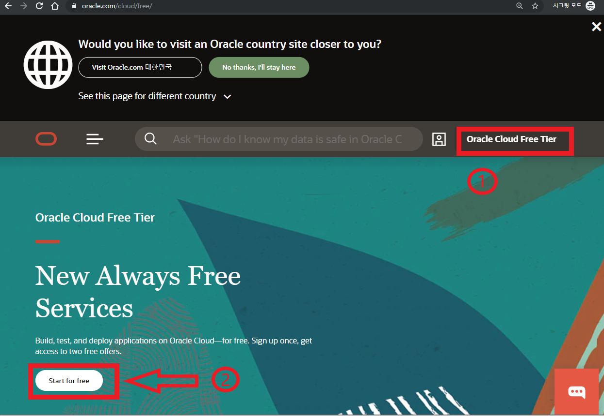


>이메일 주소와 현재 위치한 지역정보 그리고 이용에 대한 동의를 체크하시고 "Next" 버튼을 클릭 합니다.
>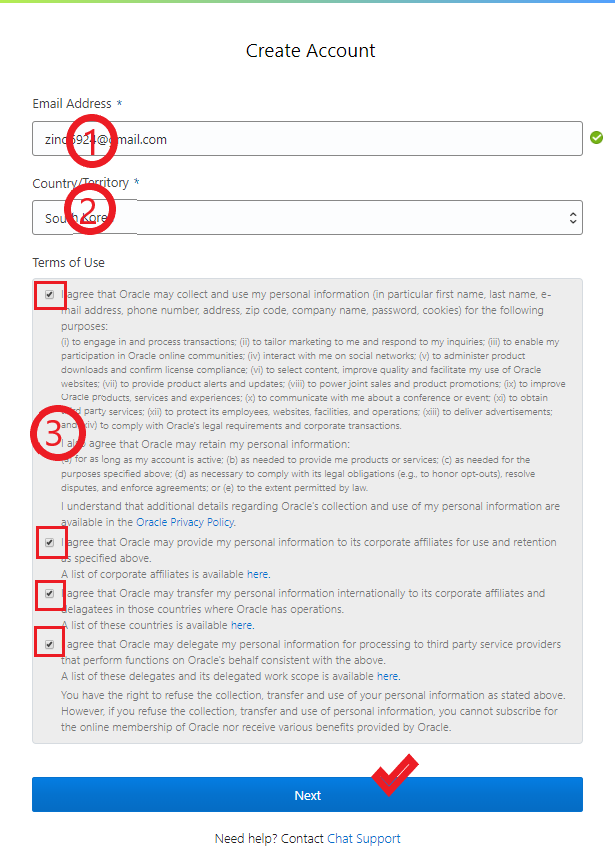

>클라우드 계정정보를 포함한 필수 항목을 모두 기입하고 "Next"버튼을 클릭 하십시오.
>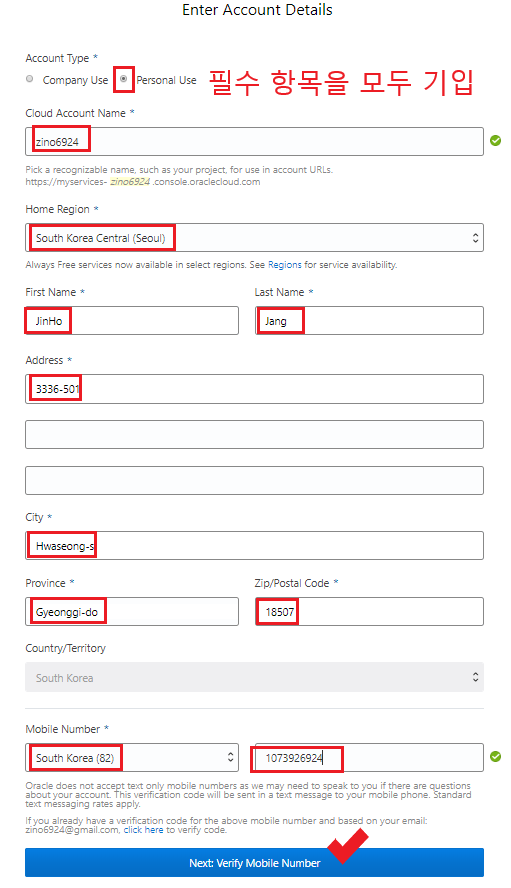

>앞에서 입력한 값이 맞으면 "Use Original"을 클릭하여 다음으로 넘어갑니다.
>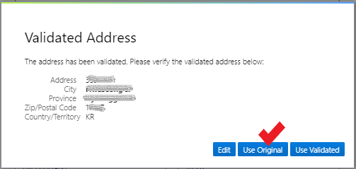

>등록한 전화번호로 인증 SMS가 발송되면 확인하고 "Verify Code"버튼을 눌러 다음으로 넘어갑니다.
>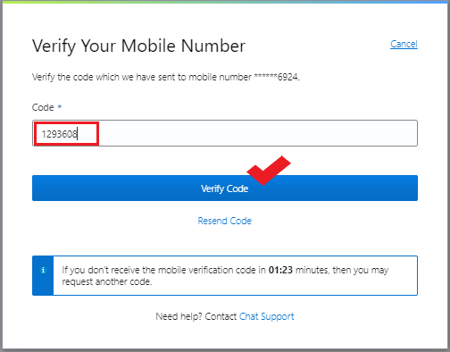

>요구되는 규칙의 패스워드를 입력하고 "Next" 카드 입력 정보로 넘어갑니다.
>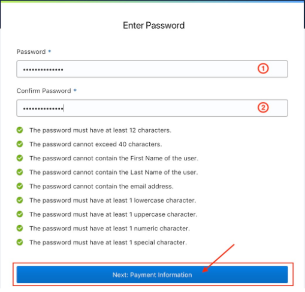

>"Add Credit Card Details"를 입력하여 카드 정보 입력 화면으로 넘어갑니다. 
>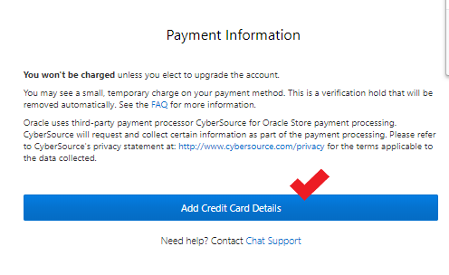

>그림과 같이 카드의 정보를 기입합니다. 카드는 인증의 용도로만 사용되고 Free Tier 사용과 관련해서 어떠한 결제도 발생하지 않습니다. 
>
>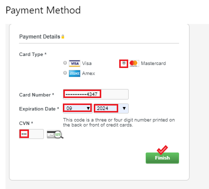
>
>
>
>해외 승인에 이어서 같은 금액의 승인 취소 내역을 곧바로 확인 할 수 있습니다.
>
>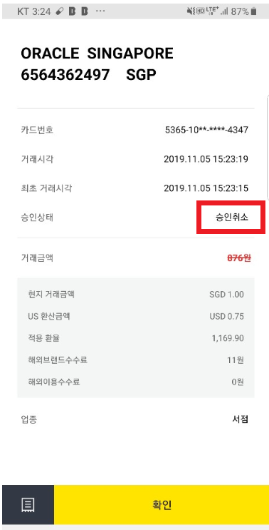

>오라클 클라우드 사용에 대한 동의를 체크하는 것을 마지막으로 Oracle Free Tier 생성 과정은 마무리 됩니다. 마지막으로 카드 결제는 Free Tier 사용자가 업그레이드를 하지 않는 한 결제되지 않을 것임을 다시 한번 강조하고 있습니다. 
>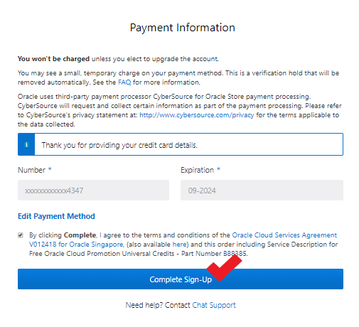

>생성한 계정을 통해서 Free Tier 환경에 정상적으로 로그인을 합니다.
>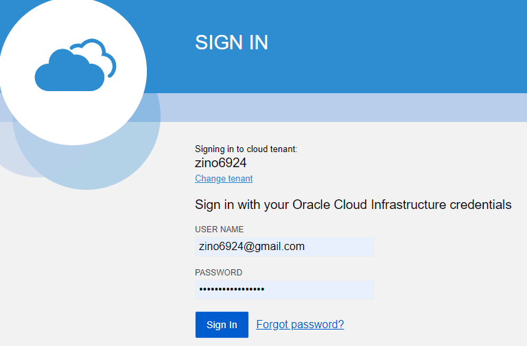
>
></details>

#### 1 단계

<details>
<summary> OCI 콘솔에 <b>로그인</b></summary>
> https://console.ap-seoul-1.oraclecloud.com 접속 > Tenant 입력 > **Continue** 클릭 > Oracle Cloud Infrastructure 아래 사용자 이름(User Name)과 암호(Password) 입력 > **Sign In** 클릭

></details>


#### 2 단계

<details>
<summary><b> VCN 생성</b>하기</summary>

1. OCI 서비스 메뉴에서 Networking 아래의  **Virtual Cloud Network** 을 클릭하고  **Create Virtual Cloud Network** 버튼을 클릭하십시오.


2. 화면 왼쪽의 드롭 다운 메뉴에서 사용자에게 할당된 Compartment를 선택 하십시오.
   **참고:* 본 실습의 환경에는 "MCD"라는 Compartment가 미리 설정되어 있습니다.

   


3. 아래의 대화 상자를 채우십시오.

**1. Name:** 쉽게 식별할 수 있는 VCN 이름을 지정합니다.

**Create in Compartment:** MCD 이름이 정상적으로 지정되어 있는지 확인 하십시오.

**2. Create Virtual Cloud Network Plus Related Resources:** 옵션을 선택 합니다.

**3. Create Virtual Cloud Network** 버튼을 클릭하여 리소스를 생성합니다.


**4. Close** 버튼을 누르고 종료 합니다.


></details>

<details>
<summary><b>보안 목록</b>에 서비스 포트 허용</summary>
1. http 80번 액세스를 제공하기 위해서 생성한 VCN내 **Security List**를 클릭 한 다음 **Default Security list for<VCN-이름>**을 클릭합니다.


2. **Ingress Rules**아래에 **Add Ingress Rule**을 클릭하고 아래의 규칙을 추가합니다.


- **STATELESS** 체크박스는 사용하지 않음으로 기본을 유지
- **SOURCE TYPE:** CIDR
- **SOURCE CIDR:** 0.0.0.0/0
- **IP PROTOCOL:** TCP
- **SOURCE PORT RANGE:** ALL
- **DESTINATION PORT RANGE:** 80


3. 하단에 **Add Ingress Rule** 버튼을 누릅니다.

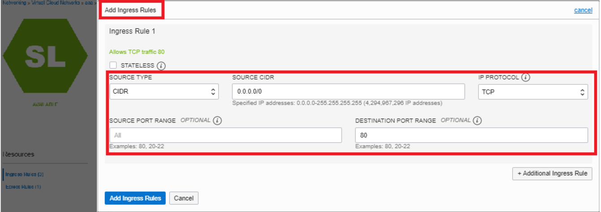


</details>


#### [SSH Key 다운로드](  https://objectstorage.ap-seoul-1.oraclecloud.com/n/apackrsct01/b/bucket-20190614-1639/o/sshkeys.zip)

#### 3 단계

<details>
<summary><b>인스턴스 생성하기</b></summary>

1. OCI 서비스 메뉴에서, **Compute** 아래에 **Instances** 를 클릭합니다.


2. **Create Instance**버튼을 누르고. 아래와 같이 대화상자의 내용을 채웁니다:

	2-1. **Name your instance**: <인스턴스 이름을 입력>
	
	2-2. **Choose an operating system or image source**: OS 이미지 목록에서 선호하는 이미지를 선택하십시오.(기본 Oracle Linux 7.7 선택 권장
	
	2-3. **Hide Shape, Network, Storage Options**: 를 클릭하여 숨은 옵션을 펼쳐 주십시오.
	
	**참고**: 실습환경의 기본 선택 사항이 설정되어 있습니다.
	


3. **Configure Networking**

	**참고**: 기본 설정된 정보가 맞는지 확인 후 Public IP할당 옵션만 수정하십시오.
- **Virtual cloud network compartment**: VCN Compartment(MCD)
- **Virtual cloud network**: (새로 생성한 VCN 이름)
- **Subnet Compartment:** (MCD)
- **Subnet:** (VCN생성시 함께 생성된 기본 Subnet)
- **Use network security groups to control traffic** :(Un-checked)
- **Assign a public IP address**: 옵션을 선택합니다.


4. **Boot Volume:** 기본 옵션을 유지
5. **Add SSH Keys:** 위에서 생성한 Public key를 선택하거나 혹은 직접 붙여넣기를 합니다.
6. **Create**버튼을 눌러서 인스턴스를 생성합니다.


7. **Provisioning**상태에서 **Running** 상태가 될 때까지 잠시 기다립니다.


8. **Public IP**를 이용하여 Putty로 로그인 합니다.

</details>


<details>
<summary><b>SSH Client(Putty)에 인스턴스의 접속 정보 입력</b></summary>

1. [Connection]탭의 [Data] 항목에서 -Auto-login username에 **opc** 입력


2. [SSH]탭의 [Auth] 항목에서 [Browse]버튼을 누르고 PC의 Private key를 찾아 선택 하십시오.


3. [Session] 탭에서 IP를 입력하고, 다음 접속 시 별도 설정 없이 접속하기 위해서 세션을  저장한 후 **Open**버튼을 눌러서 접속을 하십시오.


4. 마지막으로 확인 버튼을 "예" 누르면 접속이 완료 됩니다.


</details>

<details>
<summary><b>블록 볼륨을 생성하고 인스턴스에 연결</b></summary>

1. OCI 서비스 메뉴에서 블록 스토리지 아래의 **Block Volumes**을 클릭 하십시오.


2. **Create Block Volume**을 클릭하고 나타나는 대화상자를 아래와 같이 채웁니다.(Compartment MCD 확인)

- **Create in Compartment:** 올바른 Compartment가 선택되어 있는지 확인 합니다.
- **Name:** 생성 할 블록볼륨의 이름을 지정하십시오(예 "block_vm)
- **Availability Domain:** 사용가능한 첫번째 도메인을 선택하십시오 (멀티 AD의 경우에는 연결 할 Compute인스턴스와 동일한 AD에 속하도록 합니다).
- **SIZE:** 50 (GB 단위의 입력 값이며 이 경우 50GB가 설정 됩니다)
- **BACKUP POLICY:** 별도로 지정하지 않습니다 (만약 이 필드에서 ‘Error Retrieving Value’ 표기되면 그대로 두고 진행합니다)
- **Create Block Volume**을 클릭하고 볼륨상태가 Provisioning에서 available이 될 때까지 기다립니다.


3. 블록 볼륨을 Compute 인스턴스에 연결하기 위해서 OCI 서비스 메뉴의 **[Compute] --> [Instance]-->액션 아이콘의 [Attach Block Volume]**을 클릭하십시오.


4. 대화상자를 채운 다음 Attach 버튼을 클릭 하십시오.

- 블록 볼륨을 연결할 방법을 선택: Paravirtualized

  ​	**NOTE:**  ISCSI 모드를 사용할 수도 있습니다.  본 실습에서는 편의상 Paravirtualized를 사용합니다.

- Access: Choose READ/WRITE

- BLOCK VOLUME COMPARTMENT: 적절한 Compartment가 미리 설정되어 있습니다.

- Block Volume: 위에서 생성한 **블록 볼륨을 선택**합니다.

- Device Path: Choose a device path. **/dev/oracleoci/oraclevdb 선택**

- *Attach**버튼을 클릭하십시오.


5. **이제 블록 볼륨이 생성되어 Compute 인스턴스에 연결 되었습니다.**
   Compute 인스턴스의 리소스중 **Attached Block Volumes**에 블록 볼륨이 연결되어 있는지 확인 하십시오.


</details>

<details>
<summary><b>블록 볼륨 마운트</b></summary>


1. lsblk 명령을 입력하여 블록 볼륨 스토리지가 초기화 되었는지 확인하십시오. 첫번째로 Attach된 스토리지는 sdb로 표기됩니다. 


2. 블록 볼륨에 파일시스템을 생성 하도록 아래와 같이 명령합니다.: 
```
sudo mkfs.ext4 -L datapartition /dev/sdb 
```
**NOTE:** 실습에서는 파티션을 구성하지 않고 전체 디스크를 사용합니다. Proceed anyway? y 를 입력하십시오

3. 디스크의 마운트 포인트를 생성 하십시오:
```
sudo mkdir -p /mnt/www/html            
```
4. 생성된 마운트 포인트(디렉토리)에 디스크를 마운트 하십시오:
```
sudo mount /dev/sdb /mnt/www/html
```
5. lsblk명령어로  /dev/sdb 볼륨이 /mnt/www/html 디렉토리에 마운트 되었는지 확인하십시오. 
```
lsblk 
```
   

</details>

<details>
<summary><b>블록 볼륨의 컨텐츠로 웹 서비스 시작하기 </b></summary>

1. http 트래픽을 허용하기 위해서 방화벽 설정에서 80번 포트 오픈 설정을 하십시오.
```
sudo firewall-cmd --permanent --add-port=80/tcp 
```
2. 방화벽을 다시 로드하여 규칙을 활성화하십시오. 

```
sudo firewall-cmd --reload 
```


3. 다음으로 아래 위치에서 App을 다운로드 할 것입니다.
```
cd /home/opc
```

4. wget 명령으로 아래 url 경로에 있는 App 패키지를 다운로드 하십시오:
```
wget https://github.com/ocilab/mcd-ocibasic/raw/master/archive/master.zip

```
5. 받은 파일을 unzip으로 압축을 해제 하십시오: 
```
unzip master.zip
```

6. 압축이 풀린 웹 컨텐츠를 Document Root가 될 마운트 포인트로 복사 하십시오:
```
sudo cp -R static/* /mnt/www/html/
```

7. 아래의 디렉토리로 이동 하십시오. 
```
cd /mnt/www/html
```

8. 파이썬 명령으로 간단한 웹 서버를 실행 하십시오. 
```
sudo python -m SimpleHTTPServer 80
```

9. 웹  브라우저에서 각자의 인스턴스의 Public IP 주소로 접속을 하십시오:
```
http://<COMPUTE_INSTANCE_PUBLIC_IP>
```

20. 브라우저에 아래의 이미지가 표시되면 정상 입니다.


**이상으로 새로 생성한 VCN에 Compute 인스턴스와 블록 볼륨을 생성 및 연결하고 여기에 웹서비스가 실행되도록 실습을 마쳤습니다. 다음 실습은 첫번째 인스턴스의 부트 볼륨을 사용하여 두번째 인스턴스를 생성하고 기존의 웹 컨텐츠가 보존되어 있는 블록볼륨을 연결 해 보겠습니다.**

</details>

#### 4 단계

<details>
<summary><b>부트 볼륨을 이용하여 새로운 인스턴스로 복원 </b></summary>

## 이 과정 에서는 블록 볼륨을 분리 한 뒤 인스턴스를 중지하고 부팅 볼륨을 사용하여 두 번째 인스턴스를 시작하여 서비스를 재개 합니다.**

1. ssh 세션에서 연결된 블록 볼륨의 마운트를 해제 하십시오:
```
sudo umount /dev/sdb 
```
2. OCI 서비스 메뉴에서  --> [Compute] --> [Instance]에서 인스턴스 이름을 클릭하고  **Attached Block Volume** 섹션의 액션 아이콘에서 **Detach**를 클릭 하십시오.(팝업 창에 OK 확인 버튼을 한번 더  누릅니다)


3. Compute 인스턴스에서  **Stop** 버튼과 **OK** 확인창 버튼을 차례로 클릭하십시오.


4. 인스턴스가 정지 상태에 있으면, **Boot Volume**을 클릭하고 오른쪽 액션 아이콘에 **Detach**와 **OK** 확인 버튼을 차례로 클릭하십시오. (이제 인스턴스는 중지 상태이고 부트 볼륨은 분리되었습니다)


5. 부트 볼륨이 완전히 분리되었으면 인스턴스 상세의 액션 메뉴에서 **Terminate**버튼을 클릭하고 팝업창에서 **Terminate Instance**를 한번 더 확인합니다. 이때 팝업창 내에 **Permanently delete the attached Boot Volume**항목은 체크하지 않습니다.

   

   

6. Boot Volume의 액션 아이콘에서 **View Boot Volume Details**를 클릭 하십시오


7. Boot Volume Details 창의 상단 메뉴중에 **Create Instance:**버튼을 클릭하십시오.


8. **이하의 입력 과정은 인스턴스 생성 과정과 동일하며 Shape 변경, SSH Key 변경 등 그 밖의 파라미터 수정 가능 합니다.

 

9. **Create Instance** 버튼을 눌러서 인스턴스를 생성 하십시오.

   


9. 인스턴스가 Running 상태가 되면 블록 볼륨을 연결하십시오 . 두번째 인스턴스에서 **Attach Block Volume**을 클릭하십시오.(모든 옵션은 위에 생성한 설정과 동일)


10. 마운트 포인트(디렉토리)에 디스크를 마운트 하십시오:
```
sudo mount /dev/sdb /mnt/www/html
```

11. /mnt/www/html 디렉토리로 이동해서 웹 서비스를 재시작 하십시오.
```
cd /mnt/www/html 
sudo python -m SimpleHTTPServer 80
```

12. 웹 브라우저에서 두번째 인스턴스의 갱신 된 Public IP 주소로 접속을 하십시오,
**http://<COMPUTE_INSTANCE_PUBLIC_IP>**

13. 브라우저에서 펭수를 다시 만났다면 성공적으로 실습을 마치셨습니다. 


** 부트 볼륨을 이용해서 손쉽게 새로운 인스턴스를 생성 했고, 생성하는 동안에 구성 옵션은 얼마든지 수정 할 수 있습니다. 기존의 볼륨을 연결하여 컨텐츠를 이용할 수 있고 부트 볼륨이 가진 원래의 설정을 모두 보존 되었음을 확인하였습니다.**

</details>

