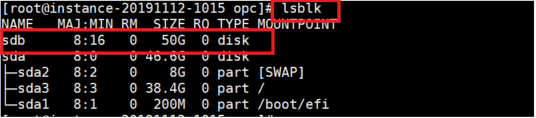

# 나 혼자 시작하는 Oracle Cloud 첫걸음: Free Tier계정을 이용한 오라클 클라우드 기본 서비스 생성

Oracle Modern Cloud Day 2019의 Developer Hands-on Track


## 과정 소개

본 핸즈온 과정은 Oracle Cloud Infrastructure를 처음 접하는 분이라도 누구나 쉽게 클라우드를 배포하고 구성하여 간단한 애플리케이션을 테스트 해 볼 수 있도록 쉬운 내용을 다루고 있으며 가장 기본이 되는 Network, Compute, Storage 리소스에 일반적인 설정으로 즉시 테스트 또는 운영환경으로 사용 할 수 있도록 구성하였습니다. 


## 사전 준비 사항


* 인터넷 접속 가능한 랩탑
* OCI (Oracle Cloud Infrastructure) 계정
* SSH Terminal (windows Putty, macOS Terminal 등)


## 실습 단계
<details>
<summary><b>시작에 앞서</b>:  Oracle Free Tier 계정 생성 절차 보기</summary>
지난 9월에 열렸던 Oracle Open World 2019에서 발표되었던 Oracle Free Tier는 기존의 한달동안 300달러 상당의 무료 계정에서 확대하여 기간 제약없이 사용 할 수 있는 Always Free Tier를 확대하여 제공하기로 하였습니다. 
>

>http://www.oracle.com 에 접속한 뒤 우측 상단의 [Oracle Cloud Free Tier]를 클릭하고 좌측 하단의[Start for free]버튼을 클릭합니다.
>


>이메일 주소와 현재 위치한 지역정보 그리고 이용에 대한 동의를 체크하시고 "Next" 버튼을 클릭 합니다.
>

>클라우드 계정정보를 포함한 필수 항목을 모두 기입하고 "Next"버튼을 클릭 하십시오.
>

>앞에서 입력한 값이 맞으면 "Use Original"을 클릭하여 다음으로 넘어갑니다.
>

>등록한 전화번호로 인증 SMS가 발송되면 확인하고 "Verify Code"버튼을 눌러 다음으로 넘어갑니다.
>

>요구되는 규칙의 패스워드를 입력하고 "Next" 카드 입력 정보로 넘어갑니다.
>

>"Add Credit Card Details"를 입력하여 카드 정보 입력 화면으로 넘어갑니다. 
>

>그림과 같이 카드의 정보를 기입합니다. 카드는 인증의 용도로만 사용되고 Free Tier 사용과 관련해서 어떠한 결제도 발생하지 않습니다. 
>
>
>해외 승인에 이어서 같은 금액의 승인 취소 내역을 곧바로 확인 할 수 있습니다.
>

>오라클 클라우드 사용에 대한 동의를 체크하는 것을 마지막으로 Oracle Free Tier 생성 과정은 마무리 됩니다. 마지막으로 카드 결제는 Free Tier 사용자가 업그레이드를 하지 않는 한 결제되지 않을 것임을 다시 한번 강조하고 있습니다. 
>

>생성한 계정을 통해서 Free Tier 환경에 정상적으로 로그인을 합니다.ㅎ
>
>
></details>


<details>
<summary> OCI 콘솔에 <b>로그인</b></summary>
> https://www.oracle.com/cloud/sign-in.html 접속 > Tenant 입력 > **Continue** 클릭 > oracleidentitycloudservice 선택(Default) > **Continue** 클릭 > 사용자 이름(User Name)과 암호(Password) 입력 > **Sign In** 클릭

></details>

<details>
<summary> 사용자, 그룹 및 Compartment 설명</summary>
설명 장표 추가 예정
></details>

<details>
<summary><b> VCN 생성</b>하기</summary>

1. OCI 서비스 메뉴에서 Networking 아래의  **Virtual Cloud Network** 을 클릭하고  **Create Virtual Cloud Network** 버튼을 클릭하십시오.


2. 화면 왼쪽의 드롭 다운 메뉴에서 사용자에게 할당된 Compartment를 선택 하십시오.
   **참고:* 본 실습의 환경에는 "MCD"라는 Compartment가 미리 설정되어 있습니다.

   


3. 아래의 대화 상자를 채우십시오.

**1. Name:** 쉽게 식별할 수 있는 VCN 이름을 지정합니다.

​		**Create in Compartment:** MCD 이름이 정상적으로 지정되어 있는지 확인 하십시오.

**2. Create Virtual Cloud Network Plus Related Resources:** 옵션을 선택 합니다.

**3. Create Virtual Cloud Network** 버튼을 클릭하여 리소스를 생성합니다.. 


**4. Close** 버튼을 누르고 종료 합니다.


></details>

<details>
<summary><b>보안 목록</b>에 서비스 포트 허용</summary>
1. http 80번 액세스를 제공하기 위해서 생성한 VCN내 **Security List**를 클릭 한 다음 **Default Security list for<VCN-이름>**을 클릭합니다.


2. **Ingress Rules**아래에 **Add Ingress Rule**을 클릭하고 아래의 규칙을 추가합니다.:


- **STATELESS** 체크박스는 사용하지 않음으로 기본을 유지
- **SOURCE TYPE:** CIDR
- **SOURCE CIDR:** 0.0.0.0/0
- **IP PROTOCOL:** TCP
- **SOURCE PORT RANGE:** ALL
- **DESTINATION PORT RANGE:** 80


3. 하단에 **Add Ingress Rule** 버튼을 누릅니다.


</details>

<details>
<summary><b>SSH Key</b>  다운로드 및 Client(Putty) 설정</summary>
[ssh key 다운로드 링크](), Putty 설정 화면 캡쳐 예정

putty.exe를 실행하고 인스턴스의 접속 정보를 입력합니다. 

1. [Connection]탭의 [Data] 항목에서 -Auto-login username에 **opc** 입력


2. [SSH]탭의 [Auth] 항목에서 [Browse]버튼을 누르고 PC의 Private key를 찾아 선택 하십시오.


3. [Session] 탭에서 IP를 입력하고, 다음 접속 시 별도 설정 없이 접속하기 위해서 세션을  저장한 후 **Open**버튼을 눌러서 접속을 하십시오.


4. 마지막으로 확인 버튼을 "예" 누르면 접속이 완료 됩니다.


</details>

<details>
<summary><b>인스턴스를 생성</b>하고 간단한 <b>애플리케니션</b>을 설치</summary>


</details>

- **STEP 5**:  인스턴스를 생성하고 간단한 애플리케니션을 설치
- **STEP 6**:  블록 볼륨을 인스턴스에 연결
- **STEP 7**:  인스턴스의 부트 볼륨을 이용하여 새로운 인스턴스로 복원 하기
- **APPENDIX**


7. OCI 콘솔로 전환하십시오. OCI 서비스 메뉴에서, **Compute** 아래에 **Instances** 를 클릭합니다.

8. **Create Instance**버튼을 누르고. 아래와 같이 대화상자의 내용을 채웁니다:

- **Name your instance**: <인스턴스 이름을 입력> 
- **Choose an operating system or image source**: OS 이미지 목록에서 선호하는 이미지를 선택하십시오.(실습을 위해서 Oracle Linux최신 버전을 권장합니다)
- **Availability Domain**: 가용성 도메인을 선택합니다.
- **Instance Type**: Virtual Machine을 선택합니다. 
- **Instance Shape**: VM.Standard2.1, VM.Standard.E2.1, VM.Standard1.1, VM.Standard.B1.1 중에 선택가능한 Shape을 지정합니다.

**Configure Networking**

- **Virtual cloud network compartment**: VCN Compartment를 선택 하십시오.
- **Virtual cloud network**: 앞에서 생성한 VCN을 선택하십시오.
- **Subnet Compartment:** Subnet Compartment를 선택하십시오.
- **Subnet:** VCN생성시 함께 생성된 기본 Subnet을 선택하십시오 
- **Use network security groups to control traffic** : 기본옵션(Un-checked)을 그대로 두십시오 
- **Assign a public IP address**: 이 옵션을 선택합니다.
- **Boot Volume:** 기본 옵션을 유지
- **Add SSH Keys:** 위에서 생성한 Public key를 선택하거나 혹은 직접 붙여넣기를 합니다.

9. **Create**버튼을 눌러서 인스턴스를 생성합니다.


10. 터미널에서 Private key가 위치한 곳에서 대기하고 인스턴스가  **Running** 상태가 될 때까지 기다립니다. 
```
 cd /C/Users/PhotonUser/.ssh
```
11. **ls** 명령으로 id_rsa 파일이 존재하는지 확인 하고,

12. 인스턴스의 Public IP를 대상으로 아래와 같이 ssh 접속을 합니다. (Oracle Linux의 기본  user명은 opc 입니다)
```
ssh -i id_rsa opc@<PUBLIC_IP_OF_COMPUTE>
```

**HINT:** If 'Permission denied error' is seen, ensure you are using '-i' in the ssh command. You MUST type the command, do NOT copy and paste ssh command

13. 보안 메시지가 표시되면 'yes'를 입력 하십시오.


14. 정상 접속이 되고 프롬프트에 opc@<인스턴스-이름> 이 표기되는지 확인 합니다.
15. 인스턴스에 OCI CLI를 설치하려면 다음 명령을 입력하십시오.


    # bash -c "$(curl –L https://raw.githubusercontent.com/oracle/oci-cli/master/scripts/install/install.sh)"

**NOTE:** 이하의 OCI CLI 설치에 필요한 설정 Dialog는 모두 기본값을 사용 하도록 하십시오.

1. 설치 위치를 묻는 프롬프트가 뜨면  기본 입력값을 사용합니다 (엔터)

2. oci 실행 파일의 위치를 묻는 프롬프트가 뜨면 기본값을 사용합니다(엔터)

3. 스크립트의 위치를 묻는 프롬프트가 뜨면 기본값을 사용합니다.(엔터)

4. 추가 옵션 CLI 패키지를 묻는 프롬프트가 뜨면 기본값을 사용 사용합니다.(엔터)

5. $PATH 업데이트 및 Shell에 Tab 자동완성을 활성화가기 위해 Profile을 수정할지 묻는 프롬프트가 뜨면(Y 엔터)

6. 마지막으로 rc file을 업데이트 할 경로를 묻는 프롬프트가 뜨면 기본값을 사용합니다(엔터)

7. 설치가 정상적으로 끝났으면 oci 명령이 동작하는 지 아래와 같이 버젼 확인을 해 봅니다.

   `# oci -v`

   

   

8. 다음으로 아래 명령을 통해서 OCI CLI의 설정을 합니다.:

   `# oci setup config`

9. 설정파일이 위치할 디렉토리명을 입력하라는 프롬프트가 뜨면 기본값(엔터)사용 하십시오. 이어서 OCID를 입력하라는 메시지가 표시됩니다.


12. OCI 콘솔창으로 전환하고 화면 오른쪽 상단의 user 아이콘을 클릭한 다음 **User Settings**을 클릭하십시오.
    User Information에서 OCID 복사를 클릭하십시오.


13. SSH 터미널에서 **"Enter a user OCID:**란에 붙여넣기 합니다. 이어서 **Enter a tenancy OCID:** 입력란이 표기됩니다. 

14. OCI 콘솔창으로 돌아가서 , User 아이콘을 클릭한 다음 Tenancy이름을 클릭합니다. User OCID를 복사한 것과 마찬가지로 Tenancy의 OCID를 복사 하십시오.


16. Switch to the SSH terminal window and paste the tenancy OCID using mouse/touch pad and press Enter. You will be prompted to Enter your region.

17. Type your region and press Enter. Enter Y for ‘New
    RSA key pair’. Press Enter and accept default options for directories. Press Enter when prompted for passphrase (i.e leave it empty)

18. In the SSH terminal session for second compute, Enter command:

     ```
     # cd /home/opc/.oci
     # ls
     ```

Verify the API key files and OCI CLI config files exist.

19. Enter command

    `# cat config`

and ensure fingerprint exists. Leave the git-bash session open as we will verify the
finger print in config file aginst OCI, once we upload api
keys next.

## Practice 3: Upload API keys and verify functionality

1. In the SSH terminal window enter command:

   `# cat /home/opc/.oci/oci_api_key_public.pem`

highlight the output, right click mouse/touchpad and click copy

2. Switch to OCI Console window, Click user icon (Top Right of OCI Console Window) and click User Settings. In User settings click **API Keys** and **Add Public Key**.

3. Paste the content of oci_api_key_public.pem copied earlier and click **Add**.

4. A new finger print will be generated. Switch to the SSH terminal session and type:

   `# cat /home/opc/.oci/config`

Compare the finger print in the output of config file to the one in OCI console window and make sure they match

**NOTE:** If multiple finger prints exist in OCI console window then identify your finger print by looking at the time stamp.

***We will now test the functionality of the CLI***

5. In the SSH terminal session, type the following command:

   `# oci iam availability-domain list`

   

    This will list all availability domains in the current region. Make note of one of the availability domain names.  It should look something like this ``nESu:PHX-AD-3``. You will use this in a future step.

6. Return to the OCI Console and navigate to **Identity** -> **Compartments**.  Retrieve the OCID of the assigned compartment.

7. Enter the following command to list VCN's:

   `# oci network vcn list --compartment-id <your compartment id>`

   

**NOTE:** It should return the details of the VCN you created at the start of this lab. If you encounter an error message, please contact the instructor.

**TIP:** You can create an environment variable for your compartment ID to avoid having to paste it each time.

`# export cid=<your compartment ocid>`

`# oci network vcn list --compartment-id $cid`


## Practice 4: Create another VCN with one public subnet

1. Create a new virtual cloud network with a unique CIDR block. You will need the OCID of your compartment.

   `# oci network vcn create --cidr-block 192.168.0.0/16 -c <your compartment OCID> --display-name CLI-Demo-VCN --dns-label clidemovcn`

   Record the ``id:`` of the resource after it is created.  You will need it in the upcoming steps.

2. Create a new security list

   `# oci network security-list create --display-name PubSub1 --vcn-id <your VCN OCID> -c $cid --egress-security-rules  '[{"destination": "0.0.0.0/0", "destination-type": "CIDR_BLOCK", "protocol": "all", "isStateless": false}]' --ingress-security-rules '[{"source": "0.0.0.0/0", "source-type": "CIDR_BLOCK", "protocol": 6, "isStateless": false, "tcp-options": {"destination-port-range": {"max": 80, "min": 80}}}]'`

   Make a note of the resource ``id:`` for use in the next step.

3. Create a public subnet.

   `# oci network subnet create --cidr-block 192.168.10.0/24 -c <your compartment OCID> --vcn-id <your VCN OCID> --security-list-ids '["<security list OCID from previous step>"]'`

   Record the ``id:`` of the resources after it is created.  You will need it in an upcoming step.

   **Note:** You have the option to specify up to 5 security lists and a custom route table.  In this case, we are only assigning one security list and allowing the system to automatically associate the default route table.

4. Create an Internet Gateway.  You will need the OCID of your VCN and Compartment.

   `# oci network internet-gateway create -c <your compartment OCID> --is-enabled true --vcn-id <your VCN OCID> --display-name DemoIGW`

   Make a note of the ``id:`` for this resource after it has been created.

5. Next, we will update the default route table with a route to the internet gateway.  First, you will need to locate the OCID of the default route table.

   `# oci network route-table list -c <your compartment OCID> --vcn-id <your VCN OCID>`

   

   Record the ``id:`` of the `Default Route Table`

6. Update the route table with a route to the internet gateway.

   `# oci network route-table update --rt-id <route table OCID> --route-rules '[{"cidrBlock":"0.0.0.0/0","networkEntityId":"<your Internet Gateway OCID"}]'`

   

   **Note:** When updating route tables or security lists you cannot insert a single rule.  You must ``update`` with the entire set of rules. The prompt shown in the screenshot above illustrates this point.


## Practice 5: Use QUERY to find Oracle Linux Image ID, then launch a compute instance

1. Use the CLI ``query`` command to retrieve the OCID for the latest Oracle Linux image.  Make a note of the image ID for future use.

   `# oci compute image list --compartment-id <your compartment OCID> --query 'data[?contains("display-name",`Oracle-Linux-7.6-20`)]|[0:1].["display-name",id]'`

   You may find more information on the Query command here: https://docs.cloud.oracle.com/iaas/Content/API/SDKDocs/cliusing.htm#ManagingCLIInputandOutput

2. Launch a compute instance with the following command.  We previously created a regional subnet because our command did not include a specific availability domain. For compute instances, we must specify an availability domain and subnet.

   You will need the following pieces of information:

   - Availability domain name
   - Subnet OCID
   - Valid compute shape (i.e. VM.Standard.E2.1)
   - Your public SSH key


    `# oci compute instance launch --availability-domain <your AD name> --display-name demo-instance --image-id <ID from previous step> --subnet-id <subnet OCID> --shape VM.Standard.E2.1 --assign-public-ip true --metadata '{"ssh_authorized_keys": "<your public ssh key here>"}'`
    
    Capture the ``id:`` of the compute instance launch output.

3. Check the status of the instances

   `# oci compute instance get --instance-id <the instance OCID> --query 'data."lifecycle-state"'`

4. Rerun the command every 30-60 seconds until the lifecycle-state is ``RUNNING``

***This completes the exercise for basic usage of the OCI CLI.***

## Bonus Exercise: Use the CLI to create the rest of the VCN resources

This section is optional and does not contain detailed instructions.  Instead, there are a series of objectives that you will complete on your own. Use the OCI CLI reference documentation for guidance.
https://docs.cloud.oracle.com/iaas/tools/oci-cli/latest/oci_cli_docs/index.html

1. Locate the public IP address of the instance using the CLI

   `# oci compute instance list-vnics --instance-id <instance OCID> | grep "ip.:"`
   ...ok, that is the last hint!

2. Attempt to connect via SSH.  Does it work? (hint: it should time out)

3. Use the CLI to create an ingress rule for SSH traffic in your custom security list.  Don't forget the ``oci network security-list update`` command requires you to pass all current and new rules.  If you just pass one rule, it will overwrite the existing rules.

4. Connect via SSH now. Is it working?

5. Create and attach a 50GB block volume to your instance.

6. Terminate / destroy all of the resources you created in this lab.  Hint: the order in which you delete the resources is very important.

***Congratulations! You have successfully completed Getting Started with OCI CLI lab.***

## Appendix A: Create an SSH key pair

**For Mac OS**

1. Terminal Window 
2. 프롬프트에서 ``ssh-keygen`` 을 입력
3. 기본 값으로 *enter*를 입력
4. 이번 실습에서는 SSH Key에 대한 비밀번호를 별도로 지정하지 마십시오. 
5. ``cat ~/.ssh/id_rsa.pub`` 를 입력하여 Public key를 조회하고 나중에 사용할 수 있도록 따로 보관하십시오

**For Windows: GitBash 또는 Windows Subsystem for Linux (WSL)**

1. 선호하는 Terminal 도구를 사용하며 이하 과정은 Mac OS & Linux 환경에서와 동일 합니다.

2. 프롬프트에서 ``ssh-keygen`` 을 입력

3. 기본 값으로 *enter*를 입력

4. 이번 실습에서는 SSH Key에 대한 비밀번호를 별도로 지정하지 마십시오.

5. ``cat ~/.ssh/id_rsa.pub`` 를 입력하여 Public key를 조회하고 나중에 사용할 수 있도록 따로 보관하십시오

   

   

**For Windows: PuttyGen 사용하기**

1. PuttyGen 열기

2. [Generate] 버튼 클릭

3. 진행률 표시 줄이 100 %에 도달 할 때까지 마우스를 화면에서 임의로 움직입니다. 

   

4. [Save private key] 버튼을 누릅니다. 이 파일은 확장자가 주어져 있지 않습니다.

   


5. 텍스트 필드에 표시된 Public key를 복사하고 수동으로 새 텍스트 파일에 저장하고 파일 이름을 id_rsa.pub로 지정하십시오.


14. OCI 서비스 메뉴에서 블록 스토리지 아래의 **Block Volumes**을 클릭 한 다음 **Create Block Volume**을 클릭하십시오.
15. 나타나는 대화상자를 아래와 같이 채웁니다.: 


- **Create in Compartment:** 올바른 Compartment가 선택되어 있는지 확인 합니다.
- **Name:** 생성 할 블록볼륨의 이름을 지정하십시오(예 "block_vm)
- **Availability Domain:** 사용가능한 첫번째 도메인을 선택하십시오 (멀티 AD의 경우에는 연결 할 Compute인스턴스와 동일한 AD에 속하도록 합니다).
- **SIZE:** 50 (GB 단위의 입력값이며 이 경우 50GB가 설정 됩니다)
- **BACKUP POLICY:** 별도로 지정하지 않습니다 (만약 이 필드에서 ‘Error Retrieving Value’ 표기되면 그대로 두고 진행합니다)

17. **Create Block Volume**을 클릭하고 볼륨상태가 Provisioning에서 available이 될 때까지 기다립니다.


18.  블록 볼륨을 Compute 인스턴스에 연결하십시오. OCI 서비스 메뉴의 Compute에서 Instance를 클릭하십시오. 

19. 위에서 생성한 compute 인스턴스의 오른쪽 메뉴에서  **Attach Block Volume**을 클릭합니다.


20. 대화상자를 채우십시오:

- 블록 볼륨을 연결할 방법을 선택: Paravirtualized

**NOTE:**  ISCSI 모드를 사용할 수도 있습니다. 자세한 내용은 다음을 참조하십시오;  ;

**https://docs.cloud.oracle.com/iaas/Content/Block/Concepts/overview.htm#attachtype** OR refer Appendix section at the end of the lab.


- BLOCK VOLUME COMPARTMENT: 적절한 Compartment가 미리 설정되어 있습니다.
- Block Volume: 위에서 생성한 블록 볼륨을 선택합니다.
- Device Path: Choose a device path. **만약 Multi device의 경우 경로가 혼동될 수 있으니 경로를 기록 해 두십시오**
- Access: Choose READ/WRITE

21. **Attach**버튼을 클릭하십시오.

22. **Close**버튼을 클릭하십시오.

**이제 블록 볼륨이 생성되어 Compute 인스턴스에 연결 되었습니다.**

23. Compute 인스턴스의 리소스중 **Attached Block Volumes**에 블록 볼륨이 연결되어 있는지 확인 하십시오.


## Install httpd on compute instance and install an app on Block Volume

1. 인스턴스에 httpd 서버를 설치하기 위해 ssh 세션으로 이동하여 아래와 같이 명령을 수행합니다:
```
sudo yum -y install httpd 
```
2. http 트래픽을 허용하기 위해서 방화벽 설정에서 80번 포트 오픈 설정을 하십시오.:
```
sudo firewall-cmd --permanent --add-port=80/tcp 
```
      (방화벽을 다시로드하여 규칙을 활성화하십시오.) 

```
sudo firewall-cmd --reload 
```


3. httpd 서비스를 시작 하십시오:
```
sudo systemctl start httpd 
```

4. lsblk 명령을 입력하여 블록 볼륨 스토리지가 초기화 되었는지 확인하십시오. 첫번째로 Attach된 스토리지는 sdb로 표기됩니다. 




5. 블록 볼륨을 포멧하기 위해서 아래 명령을 실행하십시오
```            
sudo fdisk /dev/sdb -l 
```
6. 블록 볼륨에 파일시스템을 생성 하도록 아래와 같이 명령합니다.: 
```
sudo mkfs.ext4 -L datapartition /dev/sdb 
```

**NOTE:** 실습에서는 파티션을 구성하지 않고 전체 디스크를 사용합니다. Proceed anyway? y 를 입력하십시오


7. 디스크의 마운트 포인트를 생성 하십시오:
```
sudo mkdir -p /mnt/www/html            
```

8. 생성된 마운트 포인트(디렉토리)에 디스크를 마운트 하십시오:
```
sudo mount /dev/sdb /mnt/www/html
```

9. lsblk명령어로  /dev/sdb 볼륨이 /mnt/www/html 디렉토리에 마운트 되었는지 확인하십시오. 
```
lsblk 
```


10. 다음으로 아래 위치에서 App을 다운로드 할 것입니다.
```
cd /home/opc
```
11. wget 명령으로 아래 url 경로에 있는 App 패키지를 다운로드 하십시오:
```
wget https://github.com/snafuz/oci-quickstart-lab/archive/master.zip
```
12. 받은 파일을 unzip으로 압축을 해제 하십시오: 
```
unzip master.zip
```

13. 압축이 풀린 웹 컨텐츠를 Document Root가 될 마운트 포인트로 복사 하십시오:
```
sudo cp -R oci-quickstart-lab-master/static/* /mnt/www/html/
```

14. vi로 httpd.conf 파일을 수정하십시오:
```
sudo vi /etc/httpd/conf/httpd.conf 
```
15.  문자열 /var/www을 검색하여 /mnt/www/html로 바꾸십시오.  총 3 군데의 수정지점이 있습니다. 


16. 파일을 저장하고 빠져 나갑니다. (Esc :wq!)

17. chcon 명령어로 SELinux에서 웹 컨텐츠의 보안 컨텍스트를 설정하십시오:
```
sudo chcon -R --type=httpd_sys_rw_content_t /mnt
```

18. http 서비스를 재시작 하십시오:
```
sudo systemctl restart httpd 
```

19. 웹 브라우저에서 각자의 인스턴스의 Public IP 주소로 접속을 하십시오:
```
http://<COMPUTE_INSTANCE_PUBLIC_IP>
```

20. Screen like below should appear.


**이상으로 우리는 새로 생성한 VCN에 Compute 인스턴스와 블록 볼륨을 생성 및 연결하고 여기에 웹서비스가 실행되도록 실습을 마쳤습니다. 다음으로 부가 선택 항목으로써 첫번째 인스턴스의 부트 볼륨을 사용하여 두번째 인스턴스를 생성하고 기존의 웹 컨텐츠가 보존되어 있는 블록볼륨을 연결 해 보겠습니다.**

## 옵션: 블록 볼륨을 분리하고 부트 볼륨을 사용하여 두 번째 컴퓨팅 인스턴스를 시작하고 기존의 블록 볼륨을 연결하기

**이 섹션에서는 블록 볼륨을 분리하고 컴퓨팅 인스턴스를 중지하고 부팅 볼륨을 사용하여 두 번째 컴퓨팅 인스턴스를 시작하고 두 번째 컴퓨팅 인스턴스를 삭제합니다**.

1. ssh 세션에서 연결된 블록 볼륨의 마운트를 해제 하십시오:
```
sudo umount /dev/sdb 
```
2. OCI 콘솔 윈도우에서, Compute 인스턴스 이름을 클릭하고  **Attached Block Volume** 섹션의 액션 아이콘에서 **Detach**를 클릭 하십시오.(팝업 창에 OK 확인 버튼을 한번 더  누릅니다)


3. Compute 인스턴스에서  **Stop** 버튼과 **OK** 확인창 버튼을 차례로 클릭하십시오.


4. 인스턴스가 정지 상태에 있으면, **Boot Volume**을 클릭하고 오른쪽 액션 아이콘에 **Detach**와 **OK** 확인 버튼을 차례로 클릭하십시오. (이제 인스턴스는 중지 상태이고 부트 볼륨은 분리되었습니다)


5. 부트 볼륨이 완전히 분리되었으면 인스턴스 상세의 액션 메뉴에서 **Terminate**버튼을 클릭하고 팝업창에서 **Terminate Instance**를 한번 더 확인합니다. 이때 팝업창 내에 **Permanently delete the attached Boot Volume**항목은 체크하지 않습니다.

   

   

6. Boot Volume의 액션 아이콘에서 **View Boot Volume Details**를 클릭 하십시오


7. Boot Volume Details 창의 상단 메뉴중에 **Create Instance:**버튼을 클릭하십시오.

- **Name your instance**: 새롭게 생성할 인스턴스 이름을 입력.
- **Choose an operating system or image source**: 기본 유지 (첫번째 인스턴스의 부트 볼륨)
- **Availability Domain**: 가용성 도메인을 선택

- **Instance Type**: Virtual Machine을 선택.
- **Instance Shape**: VM.Standard2.1, VM.Standard.E2.1, VM.Standard1.1, VM.Standard.B1.1 중에 선택가능한 Shape을 지정합니다.

**Configure Networking**

- **Virtual cloud network compartment**: VCN Compartment를 선택
- **Virtual cloud network**: VCN 선택
- **Subnet Compartment:** Subnet Compartment 선택 
- **Subnet:** VCN 생성시 함께 생성된 기본 Subnet을 선택
- **Use network security groups to control traffic** : 기본옵션(Un-cheched)을 유지
- **Assign a public IP address**: 선택
- **Boot Volume:** 기본 옵션을 유지
- **Add SSH Keys:** 위에서 생성한 Public key를 파일로 선택하거나 혹인 직접 붙여넣기 


8. **Create Instance** 버튼을 눌러서 인스턴스를 생성.

   


9. 인스턴스가 Running 상태가 되면 블록 볼륨을 연결하십시오 . 두번째 인스턴스에서 **Attach Block Volume**을 클릭하십시오.(모든 옵션은 위에 생성한 설정과 동일)

10. 마운트 포인트(디렉토리)에 디스크를 마운트 하십시오:
```
sudo mount /dev/sdb /mnt/www/html
```

11. httpd 섭스를 재시작 하십시오
```
sudo systemctl restart httpd
```

12. 웹 브라우저에서 두번째 인스턴스의 갱신 된 Public IP 주소로 접속을 하십시오,
**http://<COMPUTE_INSTANCE_PUBLIC_IP>**

13. 아래의 그림과 같이 웹 화면이 브라우징 되면 성공적으로 실습이 완료 된 것입니다. (입력창에 별도의 입력은 필요하지 않습니다)


**We have now successfully launched a compute instance using another instance's boot volume and re-attached a block volume that was attached to another instance. The block volume preserved all the data on it during this process. Moreover the compute instance launched using the boot volume had httpd server and fire wall configuration already present**

## Delete the resources

1. Switch to  OCI console window

2. If your Compute instance is not displayed, From OCI services menu Click **Instances** under **Compute**

3. Locate first compute instance, Click Action icon and then **Terminate** 


4. Make sure Permanently delete the attached Boot Volume is checked, Click Terminate Instance. Wait for instance to fully Terminate


5. Repeat the step to delete second compute instance

6. From OCI services menu Click **Block Volumes** under Block Storage

7. Find the storage block volume you created.

**HINT:** If multiple storage block volumes are listed, scroll down to find the one you created.   

8. Click the Action icon and select **Terminate**

9. Click OK in the confirmation window.


10. From OCI services menu Click **Virtual Cloud Networks** under Networking, list of all VCNs will 
appear.

11. Locate your VCN , Click Action icon and then **Terminate**. Click **Delete All** in the Confirmation window. Click **Close** once VCN is deleted


***Congratulations! You have successfully completed the lab. ***

## Appendix A: ISCSI Method to Attach Block Volume to Compute Instance

1. Click Action icon for the Block Volume, then **ISCSI Commands & Information**

**NOTE:** The iSCSI Commands and Information dialog box displays specific identifying information about your volume and the iSCSI commands you'll need. The commands are ready to use with the appropriate information included. You can copy and paste the commands into your instance once you login.


2. Click **Copy** in **ATTACH COMMANDS** section. 


3. Click **Close** to close the window 

4. In OCI Console Window, Click the Apps icon and Click Notepad. 

**HINT:** You can swap between the OCI window and any other application (Notepad etc.) by Clicking the Switch Window icon

5. Paste the ISCSI commands in Notepad using your mouse/touch pad or Ctrl v. 

**To attach ssh to the compute instance and paste the ISCSI commands copied earlier**

## Appendix B: ISCSI Method to Detach block volume

1. Click Action icon for the Block Volume, then **ISCSI Commands & Information**

2. Click **Copy** in **DETACH COMMANDS** section. 


3. Paste the detach command in the ssh session to the compute instance

4. In OCI console window, Click your compute instance name and in **Attached Block Volumes** section Click the action icon and Click **Detach**

